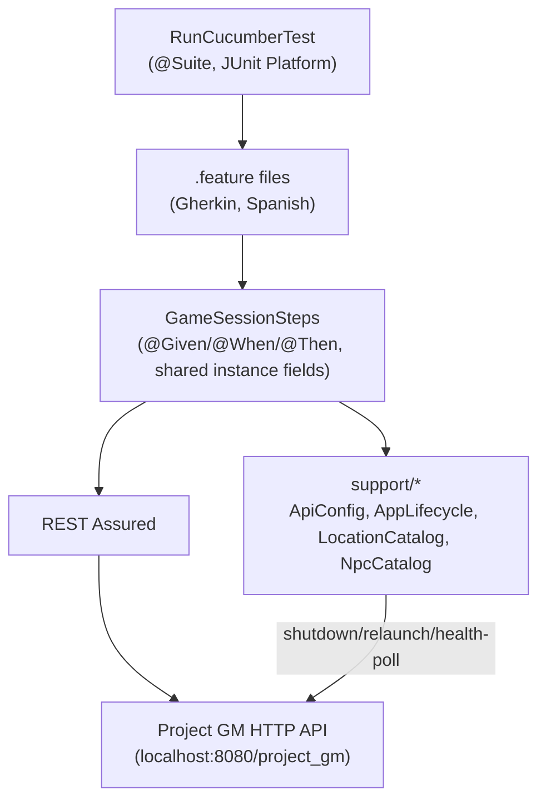

# Project GM automatics — Internal Architecture

> See also: [`overview.md`](overview.md) for purpose, [`dependencies.md`](dependencies.md) for the
> external dependency this whole repo exists to exercise.

## Layering

- **Runner**: `RunCucumberTest` is a plain JUnit 5 `@Suite` (`@IncludeEngines("cucumber")`), not a
  `@SpringBootTest` — this project has no Spring context of its own.
- **Feature files → single steps class**: all `.feature` files share one steps class,
  `GameSessionSteps` (despite the name, it now covers sessions, actions, combat, quests, NPCs and auth —
  it was never split because Cucumber-java allows stacking multiple step annotations, e.g. both `@Given`
  and `@When`, on the same method, and there is no DI module configured to wire multiple steps classes
  together cleanly).
- **Shared state via instance fields**: `playerId`, `lastSessionId`, `lastSessionVersion`,
  `lastCombatId`, etc. are plain fields on `GameSessionSteps`, carried between Gherkin steps within a
  scenario. Cucumber instantiates one steps object per scenario, so this is safe without extra
  scaffolding — but it does mean steps are **not** thread-safe / must not be parallelized without adding
  a DI module first.
- **`support/` package**: `ApiConfig` (base URI constant), `LocationCatalog`/`NpcCatalog` (fixed seed
  UUIDs mirroring "Project GM"'s Flyway migrations), `AppLifecycle` (stop/relaunch/poll the real
  "Project GM" process — see [`dependencies.md`](dependencies.md)).
- **No page objects / no UI layer** — this is a pure API-level suite; REST Assured `given()/when()/then()`
  calls are made directly from step methods.

## Key decisions (not obvious from code alone)
- **Gherkin is Spanish, step annotations are English.** `.feature` files declare `# language: es` and use
  `Dado`/`Cuando`/`Entonces`/`Y`; the corresponding Java methods are always annotated `@Given`/`@When`/
  `@Then` — never `@Dado`/`@Cuando`/`@Entonces` (those annotations don't exist in `io.cucumber.java.en`).
- **One steps class by design, not by oversight.** Splitting `GameSessionSteps` would require adding a
  DI module (PicoContainer/Spring) to inject shared state across classes — deliberately deferred until
  actually needed.
- **`AppLifecycle` is the only place that controls the "Project GM" process.** It shells out to
  `mvn spring-boot:run` via `ProcessBuilder` (`cmd.exe /c` on Windows) rather than assuming a Docker
  container or managed service — because this product runs everything as plain local Maven processes
  (no Docker, see `docs/conventions.md`).
