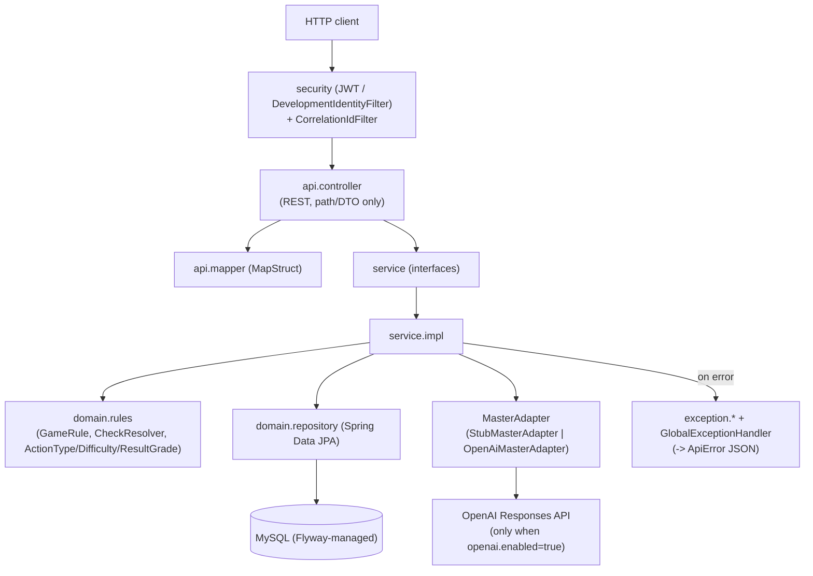

# Project GM — Internal Architecture

> See also: [`domain-model.md`](domain-model.md) for entities/rules detail, [`dependencies.md`](dependencies.md) for external deps.

## Layering

- `api.controller` — thin REST controllers; no business logic. `playerId` always comes from
  `@CurrentPlayer` (resolved from the security context), never from the request body/query.
- `api.dto.request` / `api.dto.response` — request/response records; `api.mapper` (MapStruct) converts
  request DTOs to service commands where mapping is non-trivial (e.g. `CreateSessionRequestMapper`).
- `service` (interfaces) / `service.impl` — one interface per bounded capability (`GameSessionService`,
  `ActionService`, `CombatService`, `QuestService`, `NpcService`, `ItemService`, `GameEventService`,
  `IdempotencyService`) with a single impl each, injected by type (no multi-impl selection except
  `MasterAdapter`).
- `domain.{session,character,combat,npc,quest,item,world}` / `domain.repository` — JPA entities, split
  into feature-cohesive subpackages directly under `domain` (protected no-args ctor, no public setters,
  behavior via intention-revealing methods e.g. `GameSession.advanceWorldTime`) and their Spring Data
  repositories (still flat in `domain.repository`, one per aggregate).
- `domain.rules` — deterministic game rules: `CheckResolver` performs the roll/margin computation,
  `ResultGrade.fromMargin` buckets the result, `GameRule` implementations (`ActorAliveRule`,
  `LocationExistsRule`, `NpcTargetRule`) are all injected as `List<GameRule>` and run before an action
  resolves — adding a new rule means adding a new `@Component implements GameRule`, nothing else changes.
- `exception` + `GlobalExceptionHandler` — one custom exception per domain rejection, each mapped to an
  HTTP status + stable `code` string in a single `@RestControllerAdvice` (see
  [`api-contracts.md`](api-contracts.md#errors)).
- `security` — `SecurityConfig` picks one of two mutually exclusive filter chains at startup based on
  `security.development-user-enabled`: JWT resource server (`cloud`) or `DevelopmentIdentityFilter`
  (`local`/`test`, fixed UUID unless header `X-Dev-Player-Id` overrides it). `CurrentPlayerArgumentResolver`
  is the only way a controller reads the current player.
- `config` — `CorrelationIdFilter` (MDC correlationId/sessionId for every log line), `JacksonConfig`,
  `OpenAiProperties` (`@ConfigurationProperties(prefix="openai")`).

## Key decisions / trade-offs (not obvious from code alone)

- **AI never decides outcomes.** `MasterAdapter` has exactly 3 responsibilities: `narrate` (turn an
  already-resolved `ResultGrade` into prose), `interpret` (free text → candidate `ActionType`/target —
  still validated downstream by `GameRule`s, e.g. `NpcTargetRule`), and `selectCandidate` (generic "pick
  one of these" used by both combat-attack-target and quest-choiceKey text interpretation). Any id it
  returns is re-validated against real state before being trusted — it can return `null`/an invalid id,
  never causing a silent invalid state.
- **Two `MasterAdapter` impls selected by `@ConditionalOnProperty("openai.enabled")`**: `StubMasterAdapter`
  (deterministic, no network — default for `local`/always for `test`) and `OpenAiMasterAdapter`
  (Structured Outputs via the Responses API `text.format=json_schema,strict:true`, so the model can only
  return values from a closed enum/set). Never call OpenAI from the `test` profile.
- **Optimistic concurrency** on `GameSession` (`@Version`): clients must send `expectedVersion` on
  mutating calls; a mismatch or `ObjectOptimisticLockingFailureException` both map to 409
  `STALE_SESSION_VERSION`.
- **Idempotency** on `POST .../actions` via `idempotencyKey` + `IdempotencyService`/`ProcessedAction` —
  replays return the original result instead of re-resolving. `ActionServiceImpl` checks idempotency
  **before** `expectedVersion`: a replay short-circuits with the stored payload even if the session's
  version has since moved on (deliberate — the client is asking "what happened to this exact
  submission", not "is my expected state still current").
- **Explicit IDs always override AI interpretation.** Every endpoint that can use `MasterAdapter` also
  accepts explicit ids (`actionType`/`targetNpcId`, `attackerParticipantId`/`targetParticipantId`,
  `choiceKey`) — if present, the AI path is skipped entirely (see controller `if (x != null)` branches).
- **NPCs/Locations/Quests/item templates are global catalog data** (like a static ruleset), not
  per-session; only `Relationship`, `NpcKnowledgeFact`, `QuestState`, `Item` (instances) and `Combat*`
  are per-session/mutable.
- **One `Combat` per session enforced by DB**, not just app logic — MySQL has no partial/filtered unique
  index, so a generated column (`active_session_id`, non-NULL only when `status='ACTIVE'`) + unique
  index on it emulates Postgres's `WHERE status='ACTIVE'` partial index.
