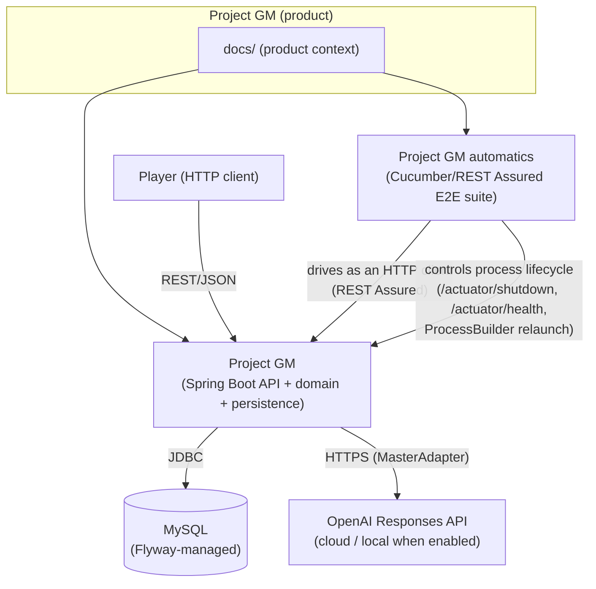

# Global Architecture (inter-repo)

> See also: for this repo's internals, [`Project GM/docs-agent/architecture.md`](../Project%20GM/docs-agent/architecture.md).

## System map

## Integration & data flow
- **Single synchronous integration path**: `Project GM automatics` calls `Project GM`'s REST API over
  HTTP exactly like a real client would (`ApiConfig.BASE_URI`, context path `/project_gm`); there is no
  message broker, shared database, or async event flow between the two repos.
- **Process-lifecycle integration (E2E only)**: `Project GM automatics`'s `AppLifecycle` support class
  also stops (`POST /actuator/shutdown`, `local` profile only) and relaunches (`ProcessBuilder` running
  `mvn spring-boot:run`) the real "Project GM" process mid-scenario, to prove game state survives a real
  restart — see [`docs/functionality/e2e-verification.md`](functionality/e2e-verification.md).
- **No shared datastore across repos**: only `Project GM` talks to MySQL; `Project GM automatics` has no
  direct DB access, it only observes state through the API.
- **No shared library/DTO package**: the two Maven projects are fully independent (separate `pom.xml`,
  no shared parent beyond `spring-boot-starter-parent` for `Project GM`); a contract change in `Project GM`
  must be manually mirrored in `Project GM automatics`'s step definitions.

## Cross-cutting concerns
- **AI isolation**: only `Project GM` talks to OpenAI, always behind the `MasterAdapter` interface; the
  AI never decides rule outcomes (see `ARCHITECTURE_CONTRACT.md`). `Project GM automatics` never touches
  the AI directly.
- **Auth**: `Project GM` derives `playerId` only from the authenticated identity (JWT claim `sub` in
  `cloud`, fixed dev UUID in `local`/`test`, overridable in tests via header `X-Dev-Player-Id`).
  `Project GM automatics` authenticates purely by sending that header — it holds no credentials of its
  own beyond it.
- **Observability**: correlation ids / structured logs / metrics are only implemented in `Project GM`
  (see `docs/observability.md`); `Project GM automatics` has no instrumentation of its own, it is a test
  harness.
- **No shared infra**: no Docker, no message broker, no deployed cloud provider decided yet
  (`CONTEXTO_PROYECTO.md`) — everything runs as local Maven-built JVM processes against a local/external
  MySQL instance.

## External documentation
None — see `docs/product-overview.md` for where product-design docs live (this repo's root, not an
external wiki).
