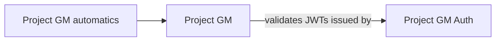

# Repository Catalog

> Agents: filter rows by #tag + "purpose" + "depends on", then open the matching repo's `docs-agent/index.md`
> (or its plain root docs, if it has none yet). Open only repos relevant to the task.

## Tag legend
Nature: `#back` `#api` `#e2e` `#idp`
Stack: `#java` `#maven`

## Repositories
| repo | tags | purpose | depends on | location |
|------|------|---------|-----------|----------|
| Project GM | #back #api #java #maven | Spring Boot game engine + API: owns all game state, rules, persistence; isolates the AI narrator behind `MasterAdapter` | Project GM Auth (`cloud` profile only, JWT issuer/JWKS trust — no direct HTTP calls between the two) | [Project GM/docs-agent/index.md](../../Project%20GM/docs-agent/index.md) |
| Project GM automatics | #e2e #java #maven | Independent Cucumber/REST Assured suite that drives Project GM's HTTP API as a black box, including restarting its real process to verify persistence | Project GM | [Project GM automatics/docs-agent/index.md](../../Project%20GM%20automatics/docs-agent/index.md) |
| Project GM Auth | #idp #api #java #maven | Spring Authorization Server: persists user accounts (own UUID per user) and issues the JWTs Project GM's `cloud` profile validates, via a custom native "password" grant (no browser) | (none — standalone IdP) | [Project GM Auth/docs-agent/index.md](../../Project%20GM%20Auth/docs-agent/index.md) |

## Depends-on graph

## Custom / Business-specific (extend here)
All three repos are plain subfolders of this same workspace (not independent git clones under a
gitignored `repos/` folder as in the generic kit) — there is a single `.git` for the whole workspace.
