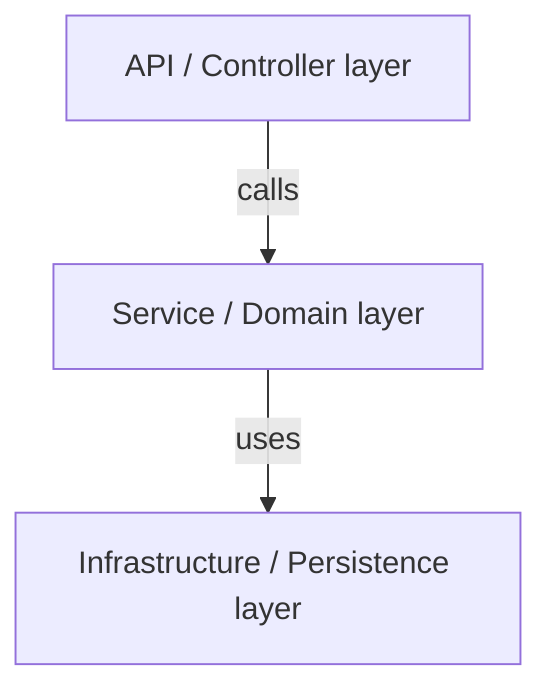

# Internal Architecture

> See also: inter-repo view in `docs/architecture.md` (product level).

## Layers / structure

## Key decisions & trade-offs
<PLACEHOLDER: ADR-style bullets an agent cannot infer from code.>

## External documentation
<PLACEHOLDER: links to diagrams/specs.>
