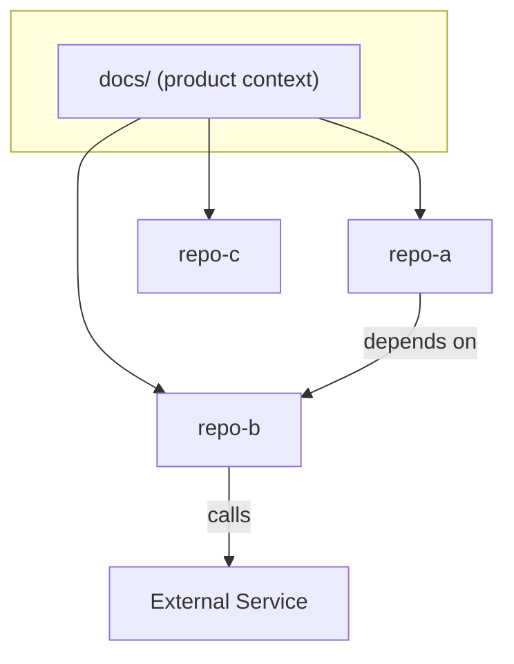

# Global Architecture (inter-repo)

> See also: for a single repo's internals, that repo's docs-agent/architecture.md.

## System map

## Integration & data flow
<PLACEHOLDER: sync/async contracts, events, shared datastores between repos.>

## Cross-cutting concerns
<PLACEHOLDER: auth, observability, shared infra — only what is common to all repos.>

## External documentation
<PLACEHOLDER: links to architecture diagrams / specs.>
